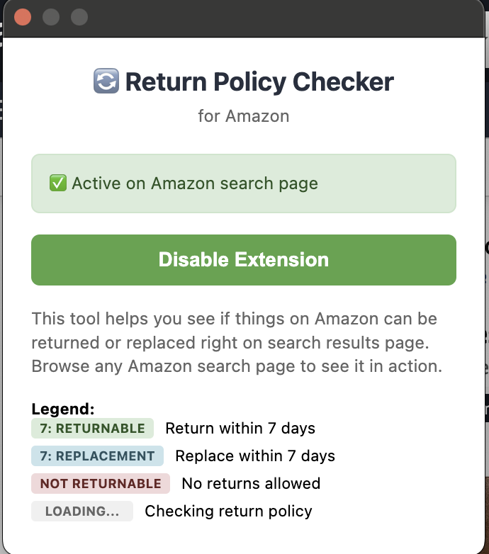
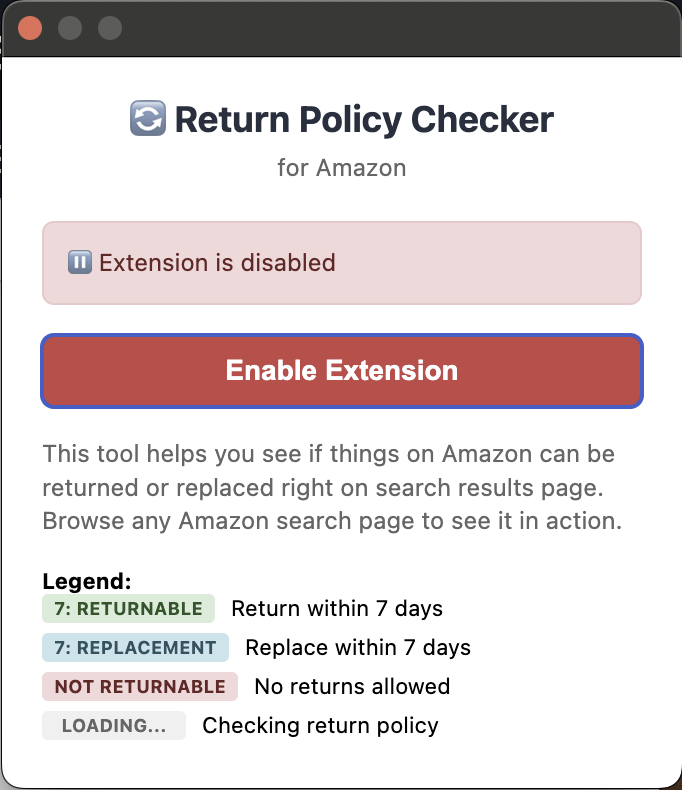
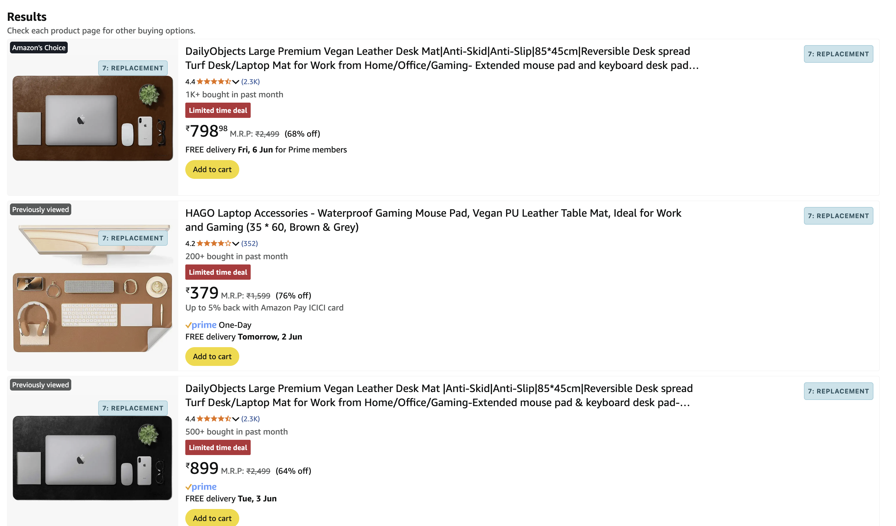

# Amazon Return Policy Checker

A Chrome extension that displays return policy information directly on Amazon search results pages.

## Features

- Automatically detects and displays return policy information directly on Amazon search pages
- Clear visual indicators for different return statuses:
  - Returnable products (with return window)
  - Replaceable products
  - Non-returnable products
  - Loading state while checking
- Easy-to-understand legend in the extension popup

## Screenshots

## Installation

1. Clone this repository or download the source code
2. Open Chrome and navigate to `chrome://extensions/`
3. Enable "Developer mode" in the top right corner
4. Click "Load unpacked" and select the extension directory

## Usage

1. After installation, the extension icon will appear in your Chrome toolbar
2. Navigate to any Amazon search results page
3. The extension will automatically check and display return policy information for each product
4. Click the extension icon to see the legend explaining different return policy indicators

## Files

- `manifest.json`: Extension configuration and permissions
- `content.js`: Content script that injects return policy information into Amazon pages
- `background.js`: Background script for extension functionality
- `popup.html`: Extension popup UI with legend
- `popup.js`: JavaScript for popup functionality
- `styles.css`: Styling for return policy badges and popup

## Development

To modify or enhance the extension:

1. Make your changes to the source files
2. Reload the extension in `chrome://extensions/`
3. Test the changes on Amazon search pages

## Contributing

Contributions are welcome! Please feel free to submit a Pull Request.

## License

This project is open source and available under the MIT License.